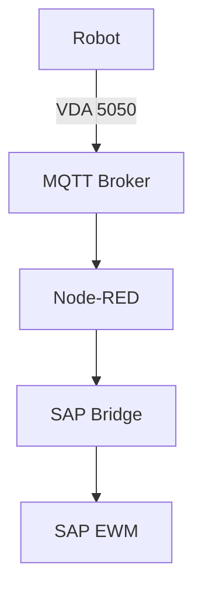

# Obsidian Quick Start Guide - EWM Robotic Platform

## ✅ What's Been Set Up

### 1. **Vault Structure**
Your project folder is now organized as an Obsidian vault with:
- **Numbered folders** for logical organization (00_inbox → 07_troubleshooting)
- **Templates** for common document types (ADRs, Components, Runbooks, Troubleshooting)
- **Asset management** for images and diagrams

### 2. **Obsidian Configuration**
Configuration file created at `.obsidian/app.json` with:
- Line numbers enabled
- Source view as default
- Strict line breaks for better markdown rendering
- Attachment folder set to `assets/attachments`

## 🚀 Getting Started

### Step 1: Open Your Vault
1. Launch Obsidian
2. Click "Open folder as vault"
3. Navigate to: `d:\EWM Robot\Robotic Platform Codes`
4. Click "Open"

### Step 2: Install Recommended Plugins
Go to **Settings → Community Plugins → Browse** and install:

#### Essential Plugins
1. **Dataview** - Query and display your notes dynamically
2. **Templater** - Advanced template system (better than built-in)
3. **Obsidian Git** - Auto-sync with Git repository
4. **Excalidraw** - Hand-drawn style diagrams
5. **Kanban** - Project management boards

#### Recommended Plugins
6. **Mermaid Tools** - Diagram support (already supported natively)
7. **Calendar** - Calendar view for daily notes
8. **Periodic Notes** - Weekly/monthly/quarterly notes
9. **Mind Map** - Visual mind maps from your notes
10. **Tag Wrangler** - Better tag management

### Step 3: Configure Plugins

#### Templater Configuration
1. Go to **Settings → Templater**
2. Set "Template folder location" to: `templates`
3. Enable "Trigger Templater on new file creation"

#### Obsidian Git Configuration
1. Go to **Settings → Obsidian Git**
2. Set "Git repository path" to your project folder
3. Enable "Commit on save" (optional)
4. Set backup interval: 5 minutes

## 📝 Using Templates

### Create New Note with Template
1. Press `Ctrl+P` (Command Palette)
2. Type "Templater: Insert template"
3. Select the template you need:
   - **ADR Template** - For architecture decisions
   - **Component Documentation Template** - For system components
   - **Runbook Template** - For operational procedures
   - **Troubleshooting Template** - For issue tracking

### Example: Create an ADR
1. Navigate to `01_architecture/decisions/`
2. Create new file: `ADR-001-use-mqtt-for-robot-communication.md`
3. Apply ADR Template
4. Fill in the sections

## 🔗 Linking Documents

### Wiki-Links (Recommended)
```markdown
[[Document Name]] - Links to another note
[[Document Name|Display Text]] - Custom display text
[[01_architecture/System Architecture]] - Full path
```

### Tags
Use tags for categorization:
```markdown
#robotics #ewm #sap #vda5050 #mqtt #nodered #docker
```

### Backlinks
Obsidian automatically shows:
- **Backlinks**: Notes that link TO this note
- **Outgoing links**: Notes this note links TO

## 📊 Using Dataview

### Example: List All ADRs
Create a note and add:

````markdown
```dataview
TABLE status, date_created
FROM "01_architecture/decisions"
SORT file.name ASC
```
````

### Example: All Troubleshooting Issues
````markdown
```dataview
TABLE status, date_created
FROM "07_troubleshooting"
WHERE contains(tags, "troubleshooting")
SORT date_created DESC
```
````

## 🎯 Best Practices

### 1. **Daily Workflow**
- Use `00_inbox` for quick notes, organize later
- Use Daily Notes for meeting notes and logs
- Tag everything appropriately

### 2. **Documentation Strategy**
- **Architecture**: Use ADRs for decisions, Component docs for systems
- **Operations**: Use Runbooks for procedures, Troubleshooting for issues
- **Reference**: Keep external docs, protocols, SAP integration notes

### 3. **Mermaid Diagrams**
Obsidian natively supports Mermaid:

````markdown

````

### 4. **Git Integration**
- Commit changes regularly with Obsidian Git plugin
- Use meaningful commit messages
- Sync with remote repository for backup

## 📚 Next Steps

1. **Migrate existing docs**: Use the migration log at `05_reference/Migration Log.md`
2. **Document architecture**: Start with core components (MQTT, Node-RED, SAP Bridge)
3. **Create runbooks**: Document common operational procedures
4. **Track issues**: Use troubleshooting template for any problems
5. **Build knowledge graph**: Link related documents to see connections

## 🔧 Troubleshooting Obsidian

### Issue: Plugins not showing
- Go to Settings → Community Plugins
- Click "Safe Mode" to ensure it's OFF
- Click "Refresh" to reload plugin list

### Issue: Templates not working
- Verify Templater plugin is enabled
- Check template folder path in settings
- Restart Obsidian after installing Templater

### Issue: Links not working
- Use `[[ ]]` for wiki-links
- Check file paths are correct
- Rebuild index: Command Palette → "Force refresh vault"

## 📖 Additional Resources

- [Obsidian Help](https://help.obsidian.md/)
- [Dataview Documentation](https://blacksmithgu.github.io/obsidian-dataview/)
- [Templater Documentation](https://silentvoid13.github.io/Templater/)
- [Mermaid Documentation](https://mermaid.js.org/)

---

**Happy documenting! 🚀**
