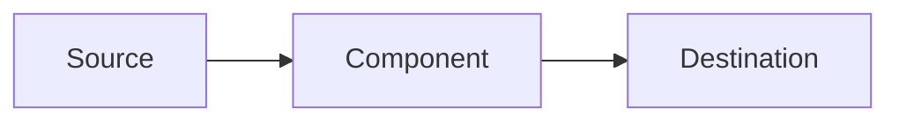

# [Component Name]

## Overview
<!-- Brief description of the component and its purpose -->

## Architecture
<!-- How this component fits into the overall system -->

### Dependencies
- **Upstream**: [[Related Component]]
- **Downstream**: [[Related Component]]

### Technology Stack
- **Language**: 
- **Framework**: 
- **Database**: 
- **Message Queue**: 

## Configuration
<!-- Key configuration parameters -->

```yaml
# Example configuration
component:
  port: 8080
  log_level: info
```

## API/Interfaces
<!-- Exposed APIs or interfaces -->

### MQTT Topics
- `topic/prefix/action` - Description

### REST Endpoints
- `GET /api/v1/endpoint` - Description

## Data Flow
<!-- How data flows through this component -->



## Deployment
<!-- How this component is deployed -->

- **Container**: Yes/No
- **Dockerfile**: `path/to/Dockerfile`
- **Docker Compose**: Service name

## Monitoring
<!-- How to monitor this component -->

- **Health Check**: `GET /health`
- **Metrics**: `/metrics`
- **Logs**: Fluent-Bit configuration

## Troubleshooting
<!-- Common issues and how to resolve them -->

### Issue 1
**Symptom**: 
**Cause**: 
**Resolution**: 

## Related Documents
- [[System Architecture]]
- [[Deployment Guide]]

## Last Updated
{{date:YYYY-MM-DD}}
